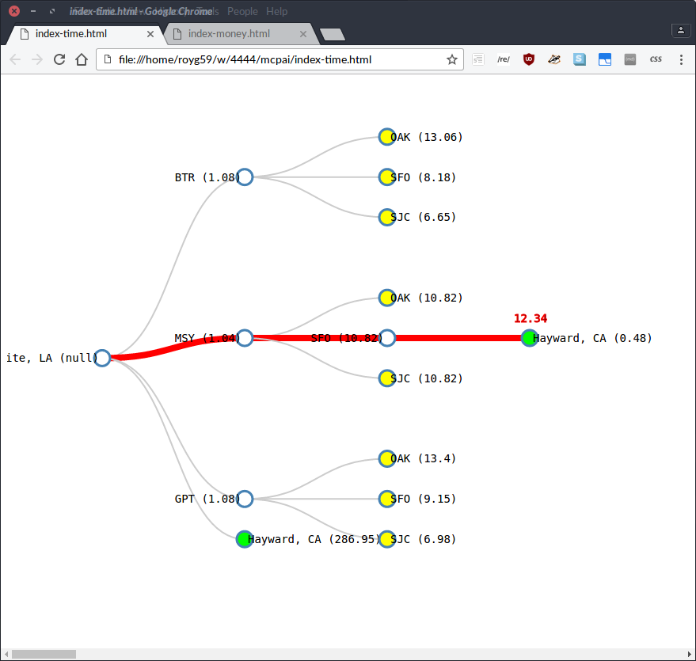

# mcpai

Minimum cost path, with multiple "superimposed" graphs. Probably
A-star.

## Usage

See the code below. A visual representation of the two searches are
shown in two html files:

- [index-time.html](index-time.html)
- [index-money.html](index-money.html)

And the output in all its gory detail is given in:

- [amite-to-hayward-output.txt](amite-to-hayward-output.txt)

```java
package searchtree;

import models.places.Location;

public class Test {
    public static void main(String[] args) {
        Location a = new Location("Amite, LA");
        Location b = new Location("Hayward, CA");
        Search s1 = new Search(a, b);
    
        System.out.println("***********************");
        System.out.print("Search by time... ");
        System.out.println(a.getLocationString() + " to " + b.getLocationString());
        s1.setLimit(500); // dollars
        s1.uniformSearch(Search.CostType.TIME);
        
        // => 
        // (For visual representation, see index-time.html)
        // ----------------------
        // Time: 8.305277777777778
        // Price: 412.2736541510362
        // Hayward, CA
        // SJC
        // BTR
        // Amite, LA
        // ----------------------
        
        System.out.println("***********************");
        System.out.print("Search by price... ");
        System.out.println(a.getLocationString() + " to " + b.getLocationString());
        s1.setLimit(24); // hours
        s1.uniformSearch(Search.CostType.PRICE);
    
        // => 
        // (For visual representation, see index-money.html)
        // ----------------------
        // Time: 8.598055555555556
        // Price: 364.2446236167799
        // Hayward, CA
        // SJC
        // MSY
        // Amite, LA
        // ----------------------
    }
}
```

### Time tree



### Price tree


## What we can get from the APIs

Given any place in the United States, we can get 

- a list of nearby airports, sorted by distance...
- the **driving distance, driving time, and driving cost
  to any other place**.
- The straight line distance to any other location

Given [any major airport](python/major-airports-only.xlsx) in the 
United States, we can get the above, plus:

- The cheapest flight(s) to any other major airport (with $ cost, and duration)

## Dev notes

Some dev notes follow

### Tests

Pls run the tests in the [test/](test/) directory. Also, update them
tests as necessary.

Easiest way to run the tests is probably in an IDE. Right click on
the "test" directory, and run all the tests.

### APIs, Dependencies

Some dependencies just work -- the included jars and the Maven
stuff.

But some APIs need a key. Just use the same one for all of these, as
long as they're all enabled (step 3 below). 

1. Go to the [Google developer console], **make a project**, call it
   `aofsdijosd` or something.

2. **Create a credential**, and pick an ordinary API key.

3. Go to **the library** (on the left side), and add all these
   services to your project (_`[*]` is optional, probably_):

  + [QPX Express Airfare API](https://console.developers.google.com/apis/api/qpxexpress-json.googleapis.com/)
  + [Google Maps Distance Matrix API](https://console.developers.google.com/apis/api/distance_matrix_backend/)
  + [Google Maps Geocoding API](https://console.developers.google.com/apis/api/geocoding_backend/)
  + [Google Maps Geolocation API](https://console.developers.google.com/apis/api/geolocation/)
  + [Google Maps Directions API](https://console.developers.google.com/apis/api/directions_backend/)
  + [Google Places API Web Service](https://console.developers.google.com/apis/api/places_backend/overview?project=ogretitus)
  + `[*]` Google Places API for Android
  + `[*]` Google Maps Roads API
  + `[*]` Google Maps Elevation API
  + `[*]` Google Maps Embed API
  + `[*]` Google Maps JavaScript API
  + `[*]` Google Maps Time Zone API

[Google developer console]: https://console.developers.google.com/apis/
